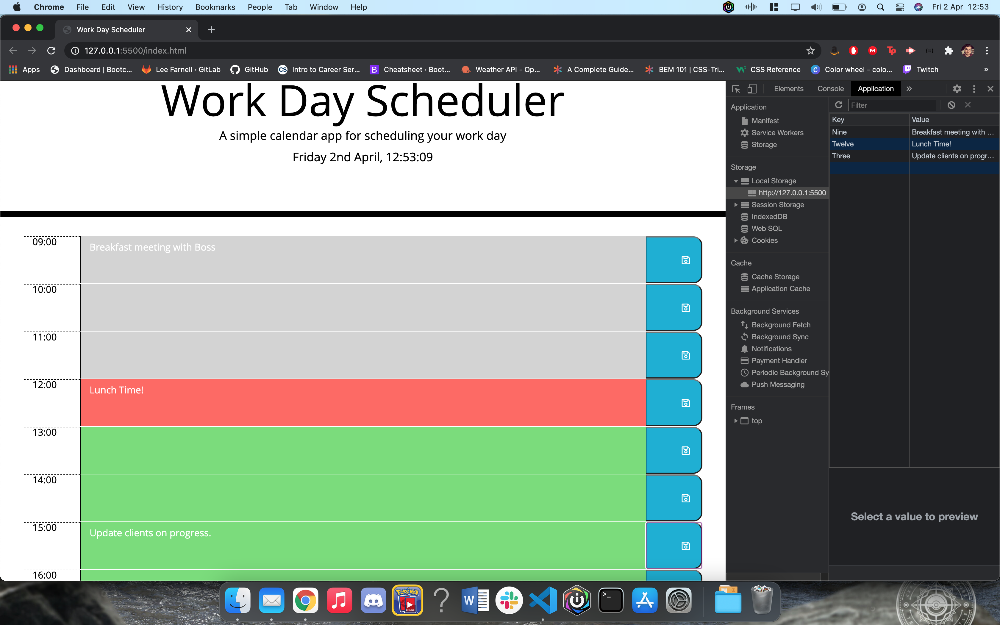

## Work Day Scheduler

Welcome to your new Work Day Schedule!

As part of the Coding BootCamp, I was tasked with a user story to create a dynamic work day scheduler, for people who need to plan out their day.

We were given a basic base code and CSS and my job was to create the necessary javascript document to ensure all the necessary criteria from the user story was met.

Some of the challenges I was tasked with were:

- Having the current date and time at the top of the page, pulling data from moment.js and adding in a function so the seconds count up in real time.
- Using jQuery and bootstrap to create the main elements of the page, including the time blocks which reflect the current hour and adding in a text area so users can enter in their schedule for that particular hour.
- Having save buttons on each row so the user can save their data into local storage.
- Creating an function so on the load of the page, all the necessary data is pulled from local storage and fills in the necessary text blocks.
- Using jQuery and CSS to iterate through the hours to determine if a particular time block is in the past, present or future, and assigning them a particular class based on this information.

I was able to create a fully working site and met all the necessary user criteria, however, I realise that some of the code I have used is not best practice. This was down to a lot of trial and error, with the main errors relating to getting the necessary information from the local storage and setting it back into the correct area. Where I have created separate elements for each local storage event, I realise now that this could of been set an array with a series of objects inside. This would of made the code a lot cleaner and saved a lot of time in terms of coding.

Overall, I have met the necessary user criteria and I am satisfied with the outcome of the this project.

## Link to deployed application:

https://leefarnell.github.io/Work_Day_Scheduler/

## Screenshots.

